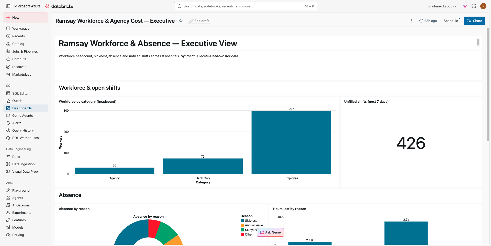
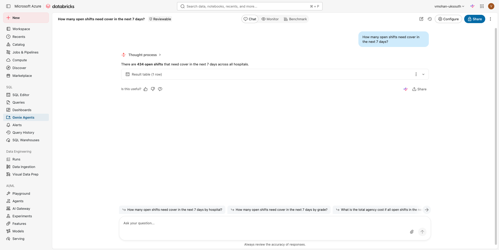
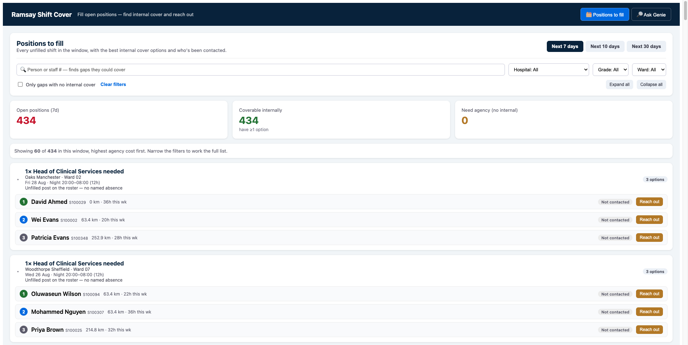

# Ramsay Workforce — Nurse Replacement Demo Script

Hi team,

Ahead of the executive session, here is the running order for the demo and the story we will
tell at each step. The narrative follows one ops manager through a single morning: a nurse has
called in sick, and we walk from *seeing the problem* to *asking about it in plain English* to
*actually resolving it* — dashboard, then Genie, then the App.

All three run on the same synthetic Allocate/HealthRoster data, across 8 hospitals. Please let me
know if you would like to change the order or the talking points.

---

## The story in one line

An ops manager starts the day, sees how many shifts are unfilled and who is off, asks a few
follow-up questions in natural language, and then opens the App to find and contact a replacement —
without ever calling an agency first.

| Act | Surface | Question it answers | Who it is for |
|---|---|---|---|
| 1 | AI/BI Dashboard | *"What does my day look like — how many gaps, who's off, and why?"* | Ops manager / exec, at a glance |
| 2 | Genie | *"Let me ask my own follow-up questions of the same data."* | Anyone, no SQL needed |
| 3 | Shift-Cover App | *"Now find me a replacement and let me reach out."* | Ops manager, taking action |

---

## Act 1 — Start with the Dashboard (see the problem)

**Open with:** *"This is what an ops manager sees first thing in the morning."*

Lead with the dashboard because it frames the whole problem before we touch any AI. It is the
same data the rest of the demo runs on, so the numbers here will reconcile everywhere.

**Talking points, left to right:**

- **Workforce by category** — 400 staff: 297 Employee, 73 Bank, 30 Agency. This sets up the
  economics — agency is the expensive, last-resort tier we are trying to avoid.
- **Unfilled shifts (next 7 days) = 426** — the headline problem. *"Every one of these is a shift
  with no one currently rostered to it."*
- **Absence by reason** and **Hours lost by reason** — *why* the gaps exist. Sickness is the
  largest driver, then Annual Leave, then Study Leave.

**Land the point:** *"So the manager knows the scale of the problem — but a dashboard can't tell
them what to do about any single gap. For that, they start asking questions."*

---

## Act 2 — Showcase Genie (ask the data)

**Open with:** *"Instead of raising a ticket for a report, the manager just asks — in plain
English."*

This is where we show that the same data is now conversational. No SQL, no BI team in the loop.
Type the questions live so the room sees Genie generate and run the query.

**Suggested questions to ask, in order:**

1. *"How many open shifts need cover in the next 7 days?"* — Genie returns ~430 open shifts, in
   line with the dashboard headline. Trust is built by the numbers landing in the same place.
2. *"How many people are on sickness leave at Springfield next week?"* — shows it understands
   hospital names (including nicknames like "Essex") and splits sickness vs. planned leave.
3. *"Who can I reach out to cover an RN shift at Springfield next week?"* — Genie asks for the
   hospital, grade and dates if they're missing, then returns eligible, non-agency staff.

**Land the point:** *"Genie is brilliant for answering questions — but it stops at the answer. It
won't hold state, it won't let me record that I've contacted someone, and it can't run the cover
decision. That's the job of the App."*

---

## Act 3 — Finish with the App (resolve it)

**Open with:** *"This is where the manager actually does the job."*

The App is the payoff — it turns the insight into an action. Walk through one gap end to end.

**Talking points:**

- **Positions to fill** — every unfilled shift in the window, each with the **top-3 ranked internal
  cover options** already worked out (proximity, grade match, working-time compliance, fairness).
  *"The App has already done the search a manager would otherwise do by hand."*
- Expand a card — show the ranked candidates: name, staff number, distance, hours worked this week,
  and whether they've been contacted. **Bank** staff are flagged.
- **Reach out** — click it on the top option. The pill flips to "Reached out" instantly, and the
  contact is logged so a second manager won't call the same nurse.
- **Filters** — narrow by hospital, grade or ward to show it works at any scale.
- **Ask Genie** tab — note we keep Genie one click away inside the App, so the manager never leaves
  their workflow to ask a follow-up.

**Land the close:** *"So in one flow: the manager saw the problem on the dashboard, asked about it
in Genie, and resolved it in the App — finding internal cover before ever paying for agency."*

---

## A few notes for the room

- **Data is synthetic** — pay rates and hospital coordinates are illustrative assumptions, not
  Ramsay actuals. Worth saying out loud once.
- **The numbers line up across all three surfaces** — the ~430 unfilled shifts on the dashboard is
  the same order of magnitude Genie returns and the same board the App works from. (Small
  differences come from date-window definitions — the dashboard scopes strictly to the next 7 days;
  Genie may include today — worth a one-line mention if an exec asks.)
- **Agency is the "before"** — the whole story is about exhausting internal and Bank cover first.

Please let me know if you'd like me to adjust the questions or the order before the session.

Thanks,

**Vaishnavi Mohan**
Solutions Architect
